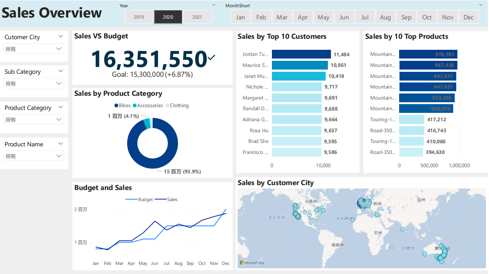

# Setup
- The main tools used in this data analysis project are SQL(SSMS) and Power BI.
- The database used in this project is AdventureWorksDW2019 from AdventureWorks sample databases, which you can get from [here](https://learn.microsoft.com/en-us/sql/samples/adventureworks-install-configure?view=sql-server-ver15&tabs=ssms).
- Because the data used in this database is before 2014 and I want some fresh data, I updated the data by a [script](https://github.com/techtalkcorner/SampleDemoFiles/blob/master/Database/AdventureWorks/Update_AdventureWorksDW_Data.sql).
# Business Request & User Stories
The business request was an executive sales report for sales managers. Based on the request that was made from the business, our stories were defined to fulfill delivery and ensure that acceptance criteria’s were maintained throughout the project.
# Data cleaning and analysis (SQL)
- To create the necessary data model for analysis and fulfilling the business needs defined in the user stories, the tables were extracted using SQL.
- One data source (sales budgets) were provided in Excel format and were connected in the data model in a later step of the process.
# Data Visualization (Power BI)

